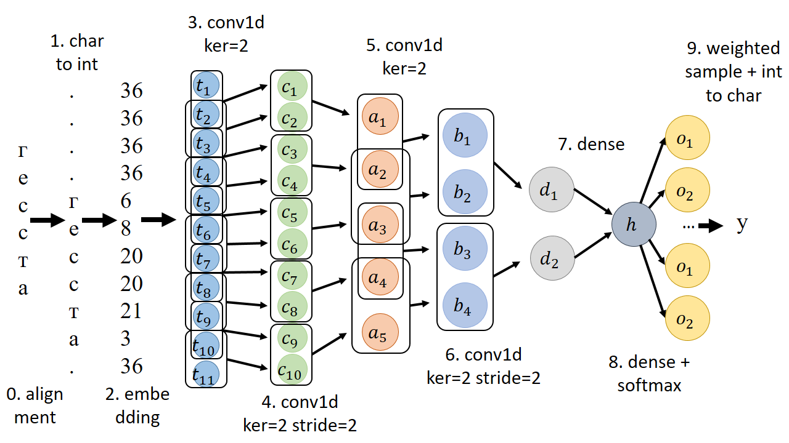

# UkreeatorWords

Ukreeator is tool for generation of new words and names for people and locations in Ukraininan.

Для україномовного варіанту README.md тицяйте [сюди](./readme_extra_resources/README.md).

Import .py file and expample of usage available [here](./Projects/Ukreeator/)

There are 4 categories of models: [pretrained](./models/pretrained/) on whole dataset, fine-tuned for [names](./models/names/) generation, fine-tined for [locations](./models/locations/) generation, and fine-tuned for general [Ukrainian words](./models/words/) generation. For each category, there are 3 trained models: tiny (1,375 params), normal (15,581 params), and extra (90,853 params).

Here are examples of generated words by extra models:

```
Names: гесстау, дозіян, григорів, матьмен, марва
Locations: прилусова, великопита, коробудівка, мателінкова, мазатне
General words: граяозні, гадручому, володіїш, майкаерів, магіться
```

Negative Log-Likelihood of different models on respective datasets
|            | tiny  | normal | extra |
|------------|-------|--------|-------|
| pretrained | 2.485 | 2.194  | 2.003 |
| names      | 2.441 | 2.228  | 2.112 |
| locations  | 2.177 | 1.870  | 1.706 |
| words      | 2.421 | 2.087  | 1.848 |




If you have your own dataset for fine-tuning pretrained model, you may find useful [this](./Projects/FinalTraining/Finetuning/).