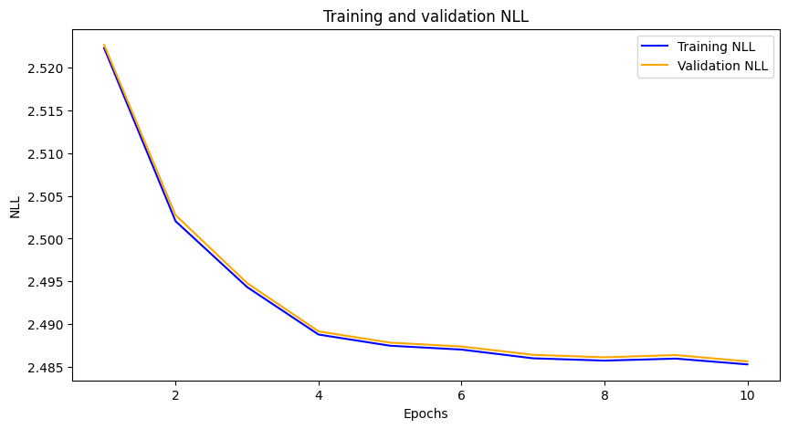
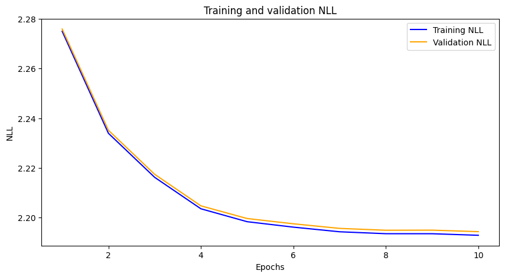
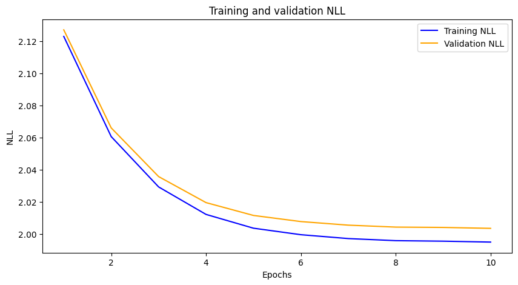

# Pretrained models

Trainning was done on whole dataset of words, 14,369,311 tokens in total (12,932,379 training tokens + 1,436,932 validations tokens).

Negative log likelihood of ***tiny*** model is 2.485 (training) or 2.485 (validation).
Number of trainable weights in ***tiny*** model 1,375.
Parameters of the ***tiny*** model: n_embd = 2, l1_n = 4, l2_n = 8, l3_n = 8, l4_n = 12, head_n = 12.

Negative log likelihood of ***normal*** model is 2.192 (training) or 2.194 (validation).
Number of trainable weights in ***normal*** model 15,581.
Parameters of the ***normal*** model: n_embd = 16, l1_n = 16, l2_n = 24, l3_n = 32, l4_n = 48, head_n = 64.

Negative log likelihood of ***extra*** model is 1.995 (training) or 2.003 (validation).
Number of trainable weights in ***extra*** model 90,853.
Parameters of the ***extra*** model: n_embd = 32, l1_n = 48, l2_n = 80, l3_n = 96, l4_n = 128, head_n = 128.

