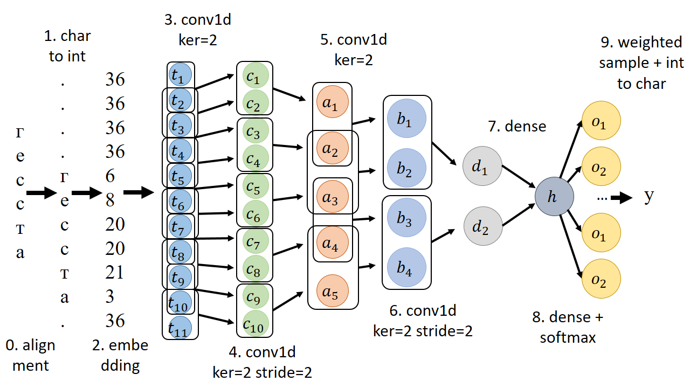

# UkreeatorWords

Ukreeator це програма яка вміє генерувати нові українські слова, імена і назви локацій.
Ukreeator працює на основі по-літерної генеративної нейронної мережі.

Приклад використання програми (і файл моделі) можна знайти [тут](../Projects/Ukreeator/)

Всього є 4 категорії моделей: [pretrained](../models/pretrained/), дотренована для генерації [імен](../models/names/), дотренована для генерації [локацій](../models/locations/) і дотренована для генерації [звичайних українських слів](../models/words/). Для кожної категорії є 3 натреновані моделі: маленька (1,375 параметрів), середня (15,581 параметрів) і велика (90,853 параметрів).

Ось приклади слів згенерованих згенерованих великою моделею:

```
Імена: гесстау, дозіян, григорів, матьмен, марва
Назви локацій: прилусова, великопита, коробудівка, мателінкова, мазатне
Звичайні слова: граяозні, гадручому, володіїш, майкаерів, магіться
```

Метрика 'Negative Log-Likelihood' рфізних моделей на відповідних датасетах
|            | tiny  | normal | extra |
|------------|-------|--------|-------|
| pretrained | 2.485 | 2.194  | 2.003 |
| names      | 2.441 | 2.228  | 2.112 |
| locations  | 2.177 | 1.870  | 1.706 |
| words      | 2.421 | 2.087  | 1.848 |


Архітектура моделі (та як до префіксу 'гесста' модель дописала букву 'у')


Якщо у вас є власний датасет, на якому ви хочете натренувати розроблену модель, можливо вам буде корисно [це](../Projects/FinalTraining/Finetuning/).